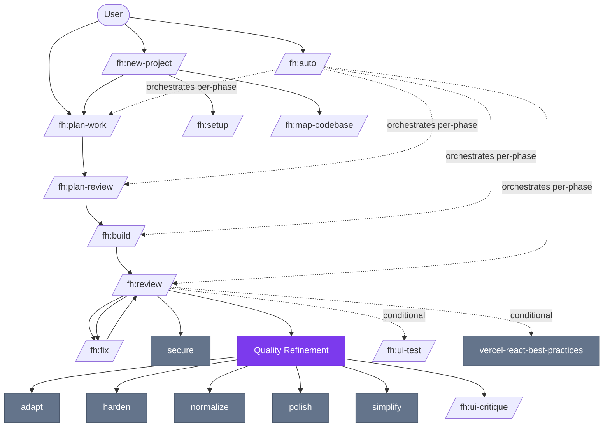
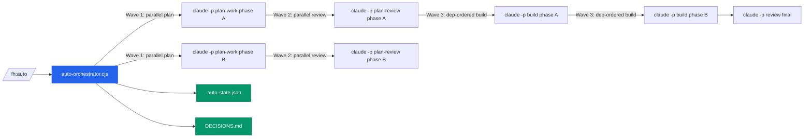
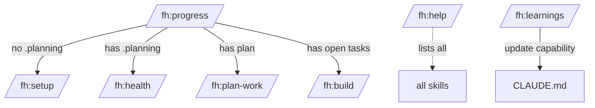
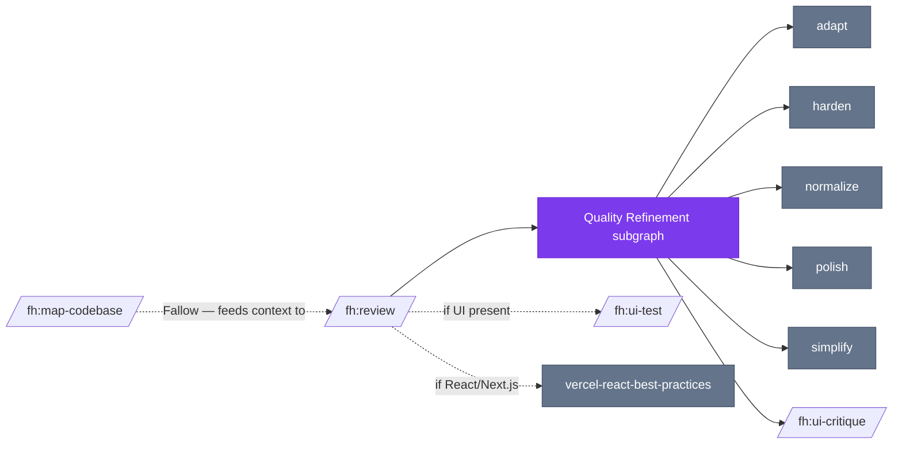

# Skills Graph — Cascades, Workflows & Orphan Analysis

> Generated 2026-03-31 | 45 shipped skills | `.claude/skills/` boundary

---

## 1. Skill Inventory

### User-Invocable (27)
Direct `/fh:X` invocation by users.

| Skill | Category | Chains to |
|-------|----------|-----------|
| `auto` | Orchestrator | plan-work → plan-review → build → review (per phase) |
| `new-project` | Onboarding | setup, map-codebase, startup-design |
| `setup` | Onboarding | help, secure, simplify |
| `progress` | Navigation | health, plan-work, plan-review, build, review |
| `health` | Navigation | — |
| `help` | Navigation | all skills (documentation only) |
| `plan-work` | Pipeline | plan-review → build |
| `plan-review` | Pipeline | build |
| `build` | Pipeline | review |
| `review` | Pipeline | fix, refactor, secure, simplify, harden, adapt, normalize, ui-critique, polish, ui-test, vercel-react-best-practices |
| `fix` | Pipeline | review, ui-test |
| `refactor` | Pipeline | — |
| `research` | Pipeline | — |
| `map-codebase` | Pipeline | — |
| `learnings` | Pipeline | CLAUDE.md (update) |
| `observability` | Pipeline | — |
| `tracker` | Utility | — |
| `settings` | Utility | — |
| `update` | Maintenance | setup, sync-upstream (cmd) |
| `ui-animate` | UI | — |
| `ui-branding` | UI | establish flow, update flow (--update flag) |
| `ui-critique` | UI | — |
| `ui-test` | UI | — |
| `startup-design` | Startup | startup-competitors → startup-positioning → startup-pitch |
| `startup-competitors` | Startup | startup-positioning, startup-pitch |
| `startup-positioning` | Startup | startup-pitch |
| `startup-pitch` | Startup | — |
| `startup-advisor` | Startup | — |

### Non-Invocable — Actually Used (7)
`user-invocable: false` but called by other skills at runtime.

| Skill | Called by | Role |
|-------|-----------|------|
| `adapt` | review (Quality Refinement) | Adapt/retrofit code patterns |
| `harden` | review (Quality Refinement), audit | Defensive hardening pass |
| `normalize` | review (Quality Refinement), audit | Code normalization pass |
| `polish` | review (Quality Refinement) | Polish/refinement pass |
| `secure` | review, setup | Security review |
| `simplify` | review (Quality Refinement), setup | Simplification pass |
| `audit` | (indirect) | Static quality audit |

### Non-Invocable — Help-Only (9)
`user-invocable: false`, only appear in `help`'s documentation listing. **Effectively orphans.**

`bolder` · `clarify` · `colorize` · `delight` · `distill` · `extract` · `onboard` · `optimize` · `quieter`

These skills exist on disk, contribute their description to Claude's context window, but are never programmatically dispatched.

---

## 2. Workflow Cascades

### 2a. Core Development Pipeline

### 2b. Autonomous Execution (fh:auto)

### 2c. Startup Validation Funnel

### 2d. Navigation / Entry Points

### 2e. Fallow Skills (Conditional Dispatch from review)

Skills dispatched by `review` only when relevant conditions are met (UI present, complexity warrants it, etc.):

> **Fallow**: `map-codebase` only connects to `review` and itself — it does not chain into build or plan-work.

---

## 3. Frontmatter Loading Implications

Claude Code loads **all** SKILL.md descriptions at session start to build its routing table, regardless of `user-invocable`. This means:

| Situation | Impact |
|-----------|--------|
| `user-invocable: false` skill | Description still loaded into context; can still be triggered by LLM if described broadly enough |
| Large description field | Every byte adds to session context overhead |
| Orphan-only skills | Pay context cost with zero user-visible benefit |

**Estimated context overhead from help-only orphans:**
The 9 help-only non-invocable skills each have SKILL.md files. Their descriptions are loaded on every session. If each averages ~2-5KB, that's ~20-40KB of context loaded that serves no routing function.

**The `disable-model-invocation: true` pattern** (used by `audit`) is the correct fix — explicitly opt out of model invocation while keeping the skill file for documentation.

---

## 4. Issues Found

### 🔴 Critical: Startup Skills Missing `fh:` Prefix in Name

5 startup skills have `name: startup-X` instead of `name: fh:startup-X`. Claude Code prefixes skills with the plugin name (`fh`), so the resulting invocation name is `fh:startup-X` — but the internal `name` field used for routing doesn't match.

**Affected:**
- `startup-advisor/SKILL.md` → `name: startup-advisor` (should be `fh:startup-advisor`)
- `startup-competitors/SKILL.md` → `name: startup-competitors`
- `startup-design/SKILL.md` → `name: startup-design`
- `startup-pitch/SKILL.md` → `name: startup-pitch`
- `startup-positioning/SKILL.md` → `name: startup-positioning`

**Fix:** Add `fh:` prefix to name field in each of these 5 files.

### 🟡 Stale References in help/SKILL.md and new-project/SKILL.md

Referenced skills that don't exist on disk (these are in documentation/UI text, not actual dispatch calls — not workflow-breaking but cause user confusion):

| Ghost Reference | Where | Likely Replacement |
|----------------|-------|-------------------|
| `/fh:plan` | help.md (3×), new-project.md | `/fh:plan-work` |
| `/fh:resume` | help.md (2×), setup.md | `/fh:progress` |
| `/fh:verify` | help.md (3×) | no replacement (deprecated?) |
| `/fh:verify-ui` | help.md (2×), new-project.md | `/fh:ui-test` |
| `/fh:qa` | update.md | no replacement |
| `/fh:sync-upstream` | update.md | lives in `.claude/commands/` only |

### 🟡 Help-Only Orphans (context waste)

9 skills with `user-invocable: false` that only appear in `help`'s documentation table and are never dispatched programmatically. They load into context on every session with no routing benefit.

**Candidates for cleanup or `disable-model-invocation: true`:**
`bolder`, `clarify`, `colorize`, `delight`, `distill`, `extract`, `onboard`, `optimize`, `quieter`

**Options:**
1. Add `disable-model-invocation: true` to their frontmatter (prevents accidental LLM triggering while keeping docs)
2. Remove entirely if the features they document are defunct

---

## 5. Skill Dependency Heat Map

Skills with the most inbound references (most "load-bearing"):

| Skill | Inbound References | Role |
|-------|--------------------|------|
| `new-project` | 11 | Entry point anchor — almost everything links here |
| `plan-work` | 9 | Core planning step |
| `build` | 5 | Core execution step |
| `review` | 7 | Core validation step — dispatches Quality Refinement |
| `setup` | 6 | Onboarding anchor |
| `startup-design` | 5 | Startup funnel entry |

Skills with zero inbound references (no other skill chains to them):
`learnings`, `map-codebase`, `observability`, `research`, `tracker`, `ui-animate`, `ui-branding` — these are all correctly user-entry-point skills, not internal helpers.

---

## 6. Summary

| Category | Count |
|----------|-------|
| Total skills on disk | 45 |
| User-invocable | 27 |
| Non-invocable, used | 7 |
| Non-invocable, help-only orphans | 9 |
| Startup skills with wrong `name` field | 5 |
| Ghost references in docs | 6 |
